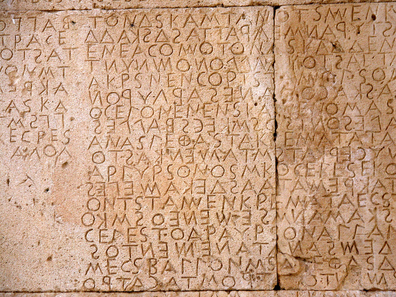

  <canvas id="glslCanvas" data-fragment-url="/assets/shaders/moon.frag" width="800" height="600" data-textures="https://rawgit.com/patriciogonzalezvivo/glslCanvas/master/data/moon.jpg"></canvas>
  

        
        
        
        <!---->
  

